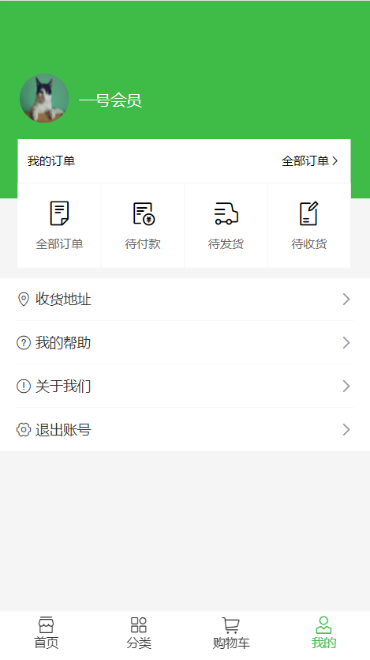
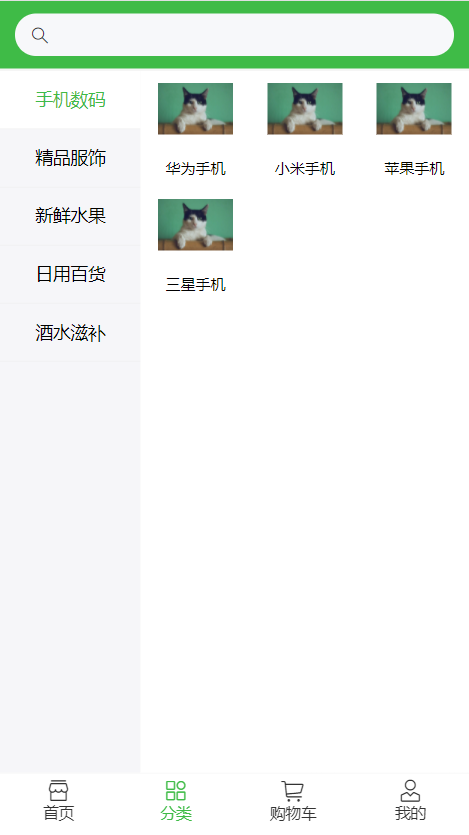
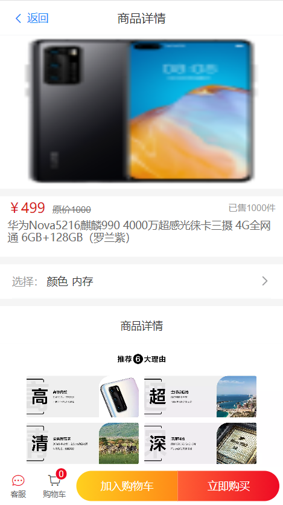
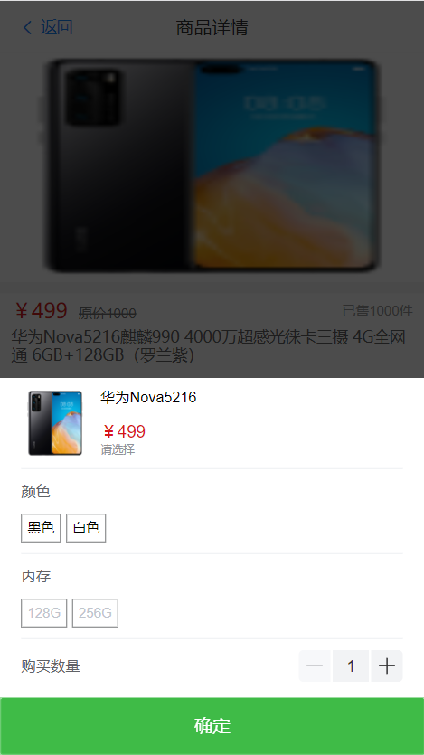
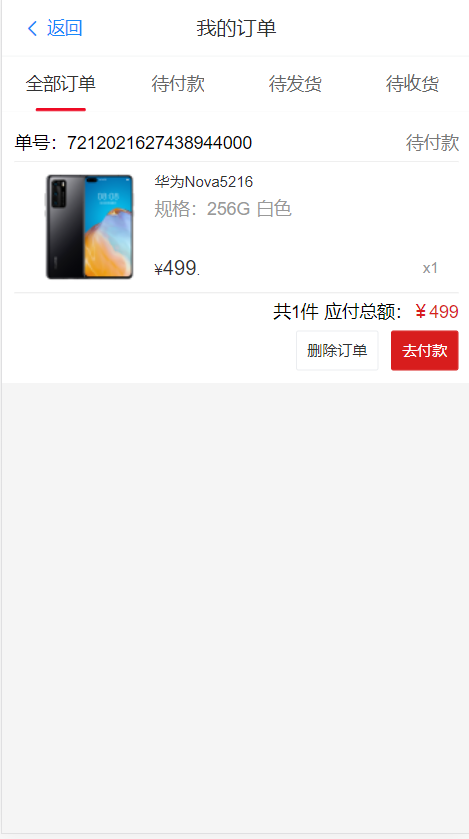

# threemetersmall_vue3_app

#### 介绍

距离vue3正式版推出已经过去了好几个月了，此次vue3带来的最大的更新就是**Composition API**和**TypeScript**的支持，但是我在网上搜索vue3+ts的实战项目，发现大部分vue3的项目依旧还是使用js来进行开发的，对于学习vue3+ts的应用没有太大帮助，所以那不如就我来写这个项目，开源出来供大家学习。选择电商项目，是因为电商类型的项目是我工作以后的第一个项目类型，所以对于这类型的项目怀有一种特殊的情怀。

**注1：此项目属于个人学习项目，仅供学习和技术研究使用，不建议商用。**

**注2：如果对您有帮助，您可以点右上角 "Star" 支持一下 谢谢！**

#### 软件架构

vue3 + ts + vuex + vue-router + webpack + vant + axios + sass

#### 安装教程

#####  前序准备

你需要在本地安装 [node](http://nodejs.org/) ，node 需要 6.0 以上版本

```bash
git clone https://gitee.com/sankeyangshu/threemetersmall_vue3_app.git

cd threemetersmall_vue3_app

npm install

npm run serve
```

#### 后端接口以及目标

前后端分离版本其他仓库：

- [三米商城后端接口 threemetersmall_koa2_api](https://gitee.com/sankeyangshu/threemetersmall_koa2_api)    

后续会继续开发vue2、mpvue、uniapp和react等版本，因为这个项目是个人的学习项目，所以我会把我所有会的技术都写一次这个项目。

。。。敬请期待

#### 项目截图

##### 个人中心  

  

##### 分类

    

##### 商品详情  

  

##### 商品规格选择  

  

##### 我的订单  

  


#### 参与贡献

1.  Fork 本仓库
2.  新建 Feat_xxx 分支
3.  提交代码
4.  新建 Pull Request

#### 许可证

[[MIT License](https://gitee.com/sankeyangshu/threemetersmall_vue3_app/blob/master/LICENSE)